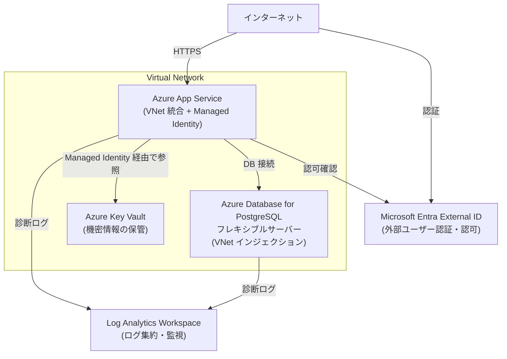

# azure-webapp-infra

Azure 上に構築する Web アプリケーションインフラの Terraform 定義コードです。

## アーキテクチャ概要



| コンポーネント | 用途 |
|---|---|
| Virtual Network | ネットワーク境界の確立。PostgreSQL・Key Vault をインターネット非公開にする |
| Azure App Service | Web アプリケーションのホスティング（VNet 統合 + Managed Identity を有効化） |
| Azure Database for PostgreSQL フレキシブルサーバー | アプリケーションのバックエンド DB（VNet インジェクションでプライベートアクセス） |
| Azure Key Vault | DB パスワード等の機密情報を一元管理。App Service は Managed Identity 経由で参照 |
| Log Analytics Workspace | App Service・PostgreSQL の診断ログ・メトリクスの集約と監視 |
| Microsoft Entra External ID | 外部ユーザー向けの認証・認可 |

## ディレクトリ構成

```
.
├── environments/               # 環境ごとの設定
│   ├── dev/
│   │   ├── main.tf
│   │   ├── variables.tf
│   │   ├── outputs.tf
│   │   └── terraform.tfvars
│   ├── staging/
│   │   ├── main.tf
│   │   ├── variables.tf
│   │   ├── outputs.tf
│   │   └── terraform.tfvars
│   └── prod/
│       ├── main.tf
│       ├── variables.tf
│       ├── outputs.tf
│       └── terraform.tfvars
├── modules/                    # 再利用可能なモジュール
│   ├── networking/             # Virtual Network・サブネット
│   ├── app_service/            # Azure App Service
│   ├── postgresql/             # Azure Database for PostgreSQL
│   ├── key_vault/              # Azure Key Vault
│   ├── log_analytics/          # Log Analytics Workspace
│   └── entra_external_id/      # Microsoft Entra External ID
└── .github/
    └── workflows/
        ├── terraform-plan.yml  # PR 時に plan を実行
        └── terraform-apply.yml # main マージ時に apply を実行
```

## 前提条件

### 必要なツール

| ツール | 推奨バージョン |
|---|---|
| [Terraform](https://developer.hashicorp.com/terraform/install) | 1.9 以上 |
| [Azure CLI](https://learn.microsoft.com/ja-jp/cli/azure/install-azure-cli) | 2.60 以上 |

### 必要な Azure 権限

- 対象サブスクリプションの `Contributor` ロール
- Microsoft Entra の `Application Administrator` ロール

## 初期セットアップ

### 1. tfstate 用ストレージの作成

tfstate は Azure Blob Storage で管理します。初回のみ以下を実行してください。

```bash
# 変数定義
RESOURCE_GROUP="rg-tfstate"
STORAGE_ACCOUNT="stterraformstate$(openssl rand -hex 4)"
CONTAINER="tfstate"
LOCATION="japaneast"

# リソース作成
az group create --name $RESOURCE_GROUP --location $LOCATION
az storage account create \
  --name $STORAGE_ACCOUNT \
  --resource-group $RESOURCE_GROUP \
  --location $LOCATION \
  --sku Standard_LRS \
  --min-tls-version TLS1_2
az storage container create \
  --name $CONTAINER \
  --account-name $STORAGE_ACCOUNT

echo "Storage Account Name: $STORAGE_ACCOUNT"
```

作成後、`environments/<env>/main.tf` の backend 設定にストレージアカウント名を記載してください。

### 2. Azure CLI でログイン

```bash
az login
az account set --subscription "<サブスクリプション ID>"
```

## 使い方

### Terraform の実行

```bash
# 対象環境のディレクトリへ移動（例: dev）
cd environments/dev

# 初期化
terraform init

# 変更内容の確認
terraform plan

# 適用
terraform apply
```

### 環境変数・tfvars の設定

`environments/<env>/terraform.tfvars` に環境ごとの値を記載します。
機密情報（DB パスワード等）は tfvars には記載せず、環境変数または Azure Key Vault で管理してください。

```bash
# 環境変数での指定例
export TF_VAR_db_password="your-secret-password"
```

## GitHub Actions による CI/CD

| ワークフロー | トリガー | 処理 |
|---|---|---|
| `terraform-plan.yml` | Pull Request 作成・更新時 | `terraform plan` を実行し結果を PR にコメント |
| `terraform-apply.yml` | `main` ブランチへのマージ時 | `terraform apply` を自動実行 |

### GitHub Actions に必要なシークレット

リポジトリの Settings > Secrets and variables > Actions に以下を登録してください。

| シークレット名 | 説明 |
|---|---|
| `AZURE_CLIENT_ID` | サービスプリンシパルのクライアント ID |
| `AZURE_TENANT_ID` | Azure テナント ID |
| `AZURE_SUBSCRIPTION_ID` | Azure サブスクリプション ID |

> GitHub Actions からの認証には、パスワードレスな **OpenID Connect (OIDC)** 方式を推奨します。

## セキュリティに関する注意事項

- **tfstate には機密情報が含まれます。** Blob Storage のアクセス制御を適切に設定し、パブリックアクセスは無効にしてください。
- `terraform.tfvars` に機密情報を記載しないでください。`.gitignore` に追加することを推奨します。
- DB のパスワードなどの機密値は [Azure Key Vault](https://learn.microsoft.com/ja-jp/azure/key-vault/) での管理を推奨します。
- サービスプリンシパルには最小権限の原則に従い、必要最低限のロールのみ付与してください。
