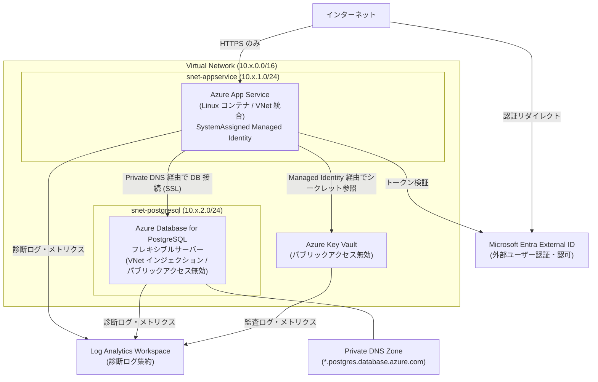
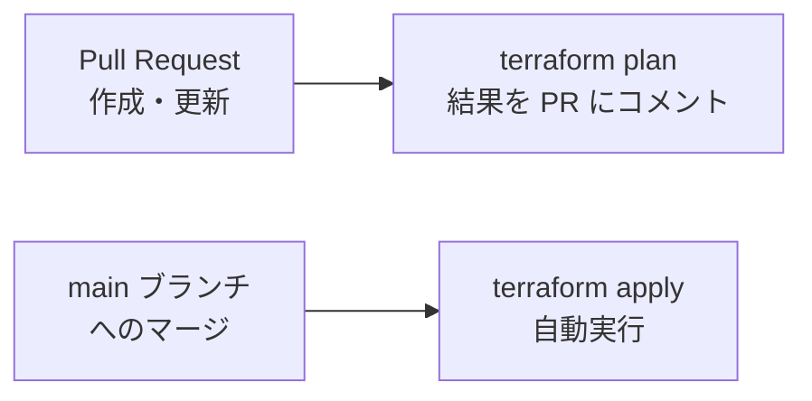

# インフラ設計書

## 1. 概要

本ドキュメントは、Azure 上に構築する Web アプリケーションインフラの設計書です。
Terraform によって管理され、dev / staging / prod の 3 環境を提供します。

---

## 2. アーキテクチャ概要



---

## 3. コンポーネント詳細

### 3.1 Virtual Network (`modules/networking`)

| リソース | 名前パターン | 説明 |
|---|---|---|
| Virtual Network | `vnet-<env>` | 全コンポーネントのネットワーク境界 |
| サブネット (App Service) | `snet-appservice-<env>` | App Service VNet 統合用。`Microsoft.Web/serverFarms` に委任 |
| サブネット (PostgreSQL) | `snet-postgresql-<env>` | PostgreSQL 専用。`Microsoft.DBforPostgreSQL/flexibleServers` に委任 |
| Private DNS Zone | `<env>.postgres.database.azure.com` | PostgreSQL の名前解決に使用 |
| VNet リンク | `vnetlink-postgresql-<env>` | Private DNS Zone を VNet に関連付け |

**ネットワーク分離設計:**
- App Service と PostgreSQL はそれぞれ専用のデリゲーション済みサブネットに配置
- PostgreSQL はパブリックネットワーク無効 (`public_network_access_enabled = false`)
- Private DNS Zone により、VNet 内からのみ PostgreSQL FQDN が解決可能

---

### 3.2 App Service (`modules/app_service`)

| 属性 | 値 |
|---|---|
| リソース名 | `app-<env>-<suffix>` |
| プラン名 | `asp-<env>` |
| OS | Linux |
| ランタイム | Docker コンテナ |
| HTTPS 強制 | 有効 (`https_only = true`) |
| FTPS | 無効 (`ftps_state = "Disabled"`) |
| HTTP/2 | 有効 |
| 最低 TLS バージョン | 1.2 |
| Managed Identity | SystemAssigned |

**アプリケーション設定 (環境変数):**

| 変数名 | 値 |
|---|---|
| `WEBSITES_PORT` | アプリのリスニングポート |
| `DATABASE_URL` | `postgresql://<user>@<fqdn>/<db>?sslmode=require` |
| `KEY_VAULT_URI` | Key Vault の URI |
| `ENTRA_AUTHORITY` | `https://login.microsoftonline.com/<tenant_id>` |
| `ENTRA_CLIENT_ID` | Entra External ID のクライアント ID |
| `APPLICATIONINSIGHTS_CONNECTION_STRING` | Application Insights 接続文字列 |

**診断ログ (Log Analytics 転送):**
- `AppServiceHTTPLogs`
- `AppServiceConsoleLogs`
- `AppServiceAppLogs`
- すべてのメトリクス (`AllMetrics`)

---

### 3.3 Azure Database for PostgreSQL (`modules/postgresql`)

| 属性 | 値 |
|---|---|
| リソース名 | `psql-<env>` |
| サーバー種別 | フレキシブルサーバー |
| PostgreSQL バージョン | 16 |
| 可用性ゾーン | Zone 1 |
| 文字コード | UTF8 / `en_US.utf8` |
| パブリックアクセス | 無効 |
| 接続方式 | VNet インジェクション + Private DNS Zone |

**診断ログ (Log Analytics 転送):**
- `PostgreSQLLogs`
- すべてのメトリクス (`AllMetrics`)

---

### 3.4 Azure Key Vault (`modules/key_vault`)

| 属性 | 値 |
|---|---|
| リソース名 | `kv-<env>-<suffix>` |
| SKU | Standard |
| パブリックアクセス | 無効 (`public_network_access_enabled = false`) |
| ネットワーク ACL | デフォルト拒否 / Azure サービスのみバイパス |
| ソフト削除保持期間 | 7 日 |
| Purge Protection | dev/staging: 無効、prod: **有効** |

**保管シークレット:**

| シークレット名 | 内容 |
|---|---|
| `db-password` | PostgreSQL 管理者パスワード |

**アクセス制御:**
- App Service の SystemAssigned Managed Identity に `Key Vault Secrets User` ロール (RBAC) を付与

**診断ログ (Log Analytics 転送):**
- `AuditEvent`（Key Vault 操作の監査ログ）
- すべてのメトリクス (`AllMetrics`)

---

### 3.5 Microsoft Entra External ID (`modules/entra_external_id`)

| 属性 | 値 |
|---|---|
| アプリ登録名 | `app-<env>-<project_name>` |
| サインイン対象 | `AzureADandPersonalMicrosoftAccount` |
| リダイレクト URI | `https://app-<env>-<suffix>.azurewebsites.net/.auth/login/aad/callback` |
| ID トークン発行 | 有効 |
| アクセストークン発行 | 無効 |

**要求する Microsoft Graph スコープ:**

| スコープ | 用途 |
|---|---|
| `openid` | OpenID Connect 認証 |
| `profile` | ユーザープロファイル取得 |
| `email` | メールアドレス取得 |

**クライアントシークレット有効期限:**
- dev / staging: `2026-12-31`
- prod: `2027-12-31`

> **注意:** `terraform apply` 後に Azure Portal で「API のアクセス許可」への管理者同意と、App Service 認証の手動設定が必要です。

---

### 3.6 Log Analytics Workspace (`modules/log_analytics`)

| 属性 | 値 |
|---|---|
| リソース名 | `log-<env>` |
| SKU | PerGB2018 |
| ログ保持期間 | dev: 30日 / staging: 60日 / prod: 90日 |

App Service・PostgreSQL・Key Vault の診断ログとメトリクスを一元集約します。

---

## 4. 環境別設定差異

| 項目 | dev | staging | prod |
|---|---|---|---|
| VNet CIDR | 10.0.0.0/16 | 10.1.0.0/16 | 10.2.0.0/16 |
| App Service サブネット | 10.0.1.0/24 | 10.1.1.0/24 | 10.2.1.0/24 |
| PostgreSQL サブネット | 10.0.2.0/24 | 10.1.2.0/24 | 10.2.2.0/24 |
| App Service SKU | B1 | P1v3 | P2v3 |
| App Service Always On | 無効 | 有効 | 有効 |
| PostgreSQL SKU | B_Standard_B1ms | GP_Standard_D2s_v3 | GP_Standard_D4s_v3 |
| PostgreSQL ストレージ | 32 GB | 64 GB | 128 GB |
| DB バックアップ保持期間 | 7 日 | 14 日 | 35 日 |
| DB geo 冗長バックアップ | 無効 | 無効 | **有効** |
| Log Analytics 保持期間 | 30 日 | 60 日 | 90 日 |
| Key Vault Purge Protection | 無効 | 無効 | **有効** |
| Entra シークレット期限 | 2026-12-31 | 2026-12-31 | 2027-12-31 |

---

## 5. セキュリティ設計

### 5.1 ネットワークセキュリティ

| 対策 | 内容 |
|---|---|
| PostgreSQL パブリックアクセス無効 | VNet 内からのみアクセス可能。インターネットから直接到達不可 |
| Key Vault パブリックアクセス無効 | ネットワーク ACL でデフォルト拒否。Azure サービスのみバイパス |
| App Service HTTPS 強制 | HTTP アクセスを HTTPS にリダイレクト |
| TLS 最低バージョン 1.2 | 古いプロトコルの使用を禁止 |
| FTPS 無効 | FTP によるデプロイを禁止 |

### 5.2 認証・認可

| 対策 | 内容 |
|---|---|
| Managed Identity | App Service はパスワードレスで Key Vault にアクセス |
| RBAC | Key Vault へのアクセスは `Key Vault Secrets User` ロールのみ付与（最小権限） |
| Entra External ID | 外部ユーザー認証を Microsoft のマネージドサービスに委任 |
| OIDC (GitHub Actions) | CI/CD パイプラインはパスワードレス OIDC 認証を使用 |

### 5.3 データ保護

| 対策 | 内容 |
|---|---|
| DB パスワードの Key Vault 保管 | `terraform.tfvars` に平文で記載しない |
| DB 接続 SSL 強制 | `sslmode=require` で暗号化通信 |
| prod Purge Protection | Key Vault の誤削除・強制消去を防止 |
| prod geo 冗長バックアップ | 障害時のデータ損失を最小化 |
| tfstate アクセス制御 | Blob Storage でのパブリックアクセス無効を推奨 |

### 5.4 監視・監査

| ログ種別 | 転送先 | 内容 |
|---|---|---|
| App Service HTTP ログ | Log Analytics | リクエスト/レスポンス情報 |
| App Service コンソールログ | Log Analytics | アプリ標準出力 |
| App Service アプリログ | Log Analytics | アプリケーションログ |
| PostgreSQL ログ | Log Analytics | クエリ・エラーログ |
| Key Vault 監査ログ | Log Analytics | シークレット操作の監査証跡 |

---

## 6. リソース命名規則

| リソース種別 | パターン | 例 |
|---|---|---|
| リソースグループ | `rg-<project>-<env>` | `rg-myapp-prod` |
| Virtual Network | `vnet-<env>` | `vnet-prod` |
| サブネット (App Service) | `snet-appservice-<env>` | `snet-appservice-prod` |
| サブネット (PostgreSQL) | `snet-postgresql-<env>` | `snet-postgresql-prod` |
| App Service Plan | `asp-<env>` | `asp-prod` |
| App Service | `app-<env>-<suffix>` | `app-prod-abc123` |
| PostgreSQL | `psql-<env>` | `psql-prod` |
| Key Vault | `kv-<env>-<suffix>` | `kv-prod-abc123` |
| Log Analytics | `log-<env>` | `log-prod` |
| Entra アプリ登録 | `app-<env>-<project>` | `app-prod-myapp` |
| 診断設定 | `diag-<service>-<env>` | `diag-app-prod` |

> `<suffix>` は Key Vault・App Service など**グローバル一意名が必要なリソース**に付与します。

---

## 7. Terraform モジュール構成

```
modules/
├── networking/          # VNet・サブネット・Private DNS Zone
├── app_service/         # App Service Plan・Linux Web App・診断設定
├── postgresql/          # PostgreSQL フレキシブルサーバー・DB・診断設定
├── key_vault/           # Key Vault・シークレット・RBAC・診断設定
├── log_analytics/       # Log Analytics Workspace
└── entra_external_id/   # Entra アプリ登録・サービスプリンシパル・シークレット
```

各モジュールは独立して再利用可能な単位に分割されており、`environments/<env>/main.tf` から呼び出されます。

---

## 8. CI/CD パイプライン



| ワークフロー | ファイル | トリガー | 処理 |
|---|---|---|---|
| Terraform Plan | `.github/workflows/terraform-plan.yml` | PR 作成・更新 | `terraform plan` を実行し結果を PR にコメント |
| Terraform Apply | `.github/workflows/terraform-apply.yml` | `main` ブランチへのマージ | `terraform apply` を自動実行 |

**GitHub Actions 認証方式:** OpenID Connect (OIDC) によるパスワードレス認証 (`ARM_USE_OIDC=true`)

**必要な GitHub シークレット:**

| シークレット名 | 説明 |
|---|---|
| `AZURE_CLIENT_ID` | サービスプリンシパルのクライアント ID |
| `AZURE_TENANT_ID` | Azure テナント ID |
| `AZURE_SUBSCRIPTION_ID` | Azure サブスクリプション ID |
| `TF_VAR_DB_PASSWORD` | PostgreSQL 管理者パスワード |

---

## 9. tfstate 管理

tfstate は Azure Blob Storage で管理します。環境ごとに独立したキーで保管します。

| 環境 | tfstate キー |
|---|---|
| dev | `dev/terraform.tfstate` |
| staging | `staging/terraform.tfstate` |
| prod | `prod/terraform.tfstate` |

**Blob Storage 設定 (共通):**
- リソースグループ: `rg-tfstate`
- コンテナ名: `tfstate`
- パブリックアクセス: **無効推奨**
- TLS 最低バージョン: 1.2

---

## 10. 依存関係

各モジュールのデプロイ依存順序は以下のとおりです。

```
log_analytics
     │
networking ──────────────────────────┐
     │                               │
entra_external_id    app_service ←── key_vault ←── (app_service の principal_id)
                          ↑
                     postgresql
```

Terraform は依存関係を自動解決しますが、`app_service` は `key_vault` の `app_service_principal_id` 出力を参照するため、内部的な循環参照に注意が必要です（現在の実装では `module.app_service.app_service_principal_id` を `module.key_vault` に渡す構造のため、`key_vault` は `app_service` の後に作成されます）。
